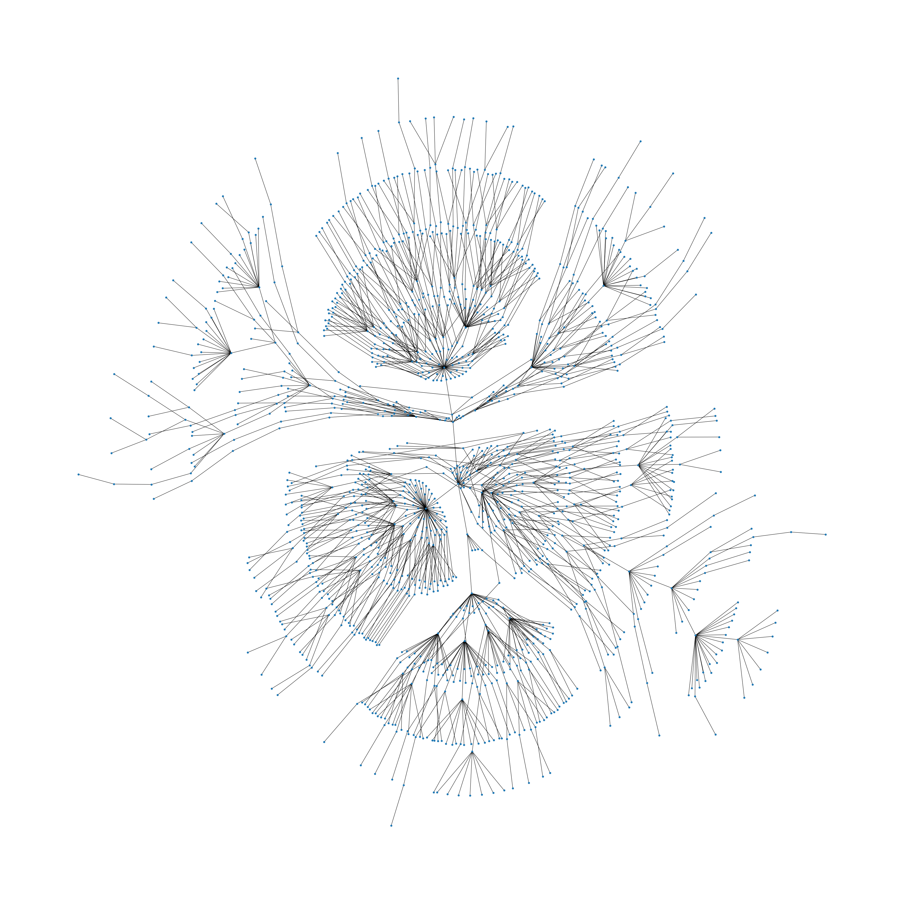

# Brazilian Jiu-Jitsu "Family Tree"

## About the Picture

In Brazilian Jiu-Jitsu, the concept of lineage is similar to that of a ancestral lineage. In a typical family tree, you would trace back your mother/father until you reach the very beginning. This would represent a single path in the tree. In Brazilian Jiu-Jitsu, you can  do a similar tracing, but this time **the "father/mother" is replaced with the individual who awarded you your black belt**. For a vast majority of people practicing Brazilian Jiu-Jitsu, the beginning, or **root node of the tree would be [Mitsuyo Maeda](https://en.wikipedia.org/wiki/Mitsuyo_Maeda).**

Below is an example from several of my old training partners.

**Lineage:** Mitsuyo Maeda > [C. Gracie](https://www.bjjheroes.com/bjj-fighters/carlos-gracie-sr-profile) > [H. Gracie](https://www.bjjheroes.com/bjj-fighters/helio-gracie) > [Rickson Gracie](https://www.bjjheroes.com/bjj-fighters/rickson-gracie-facts-and-bio) > [Marcelo Behring](https://www.bjjheroes.com/bjj-fighters/marcelo-behring) > Mario Yamasaki > David Jacobs > Matt Miller > (John Prado, Rich Fitzgerald, Jeff Palugi, Leah Buckley) 

Note: The concept of lineage isn't necessarily as strict as the concept of ancestral lineage. For example, Matt Miller trained under many different individuals before David Jacobs, but it was David who finally awarded him his Black Belt. Initially in my graph I will only consider one. Different weights could be assigned according to the number of years you trained under an individual to make a more complex Weighted Graph. 

## How to Run Pipeline

- Please see the requirements.txt file for necessary libraries to install in virtual environment. This project was coded on XUbuntu 20.04 with Python 3.8, although the code should be OS dependent.

run `python3 scripts/run_pipeline_luigi.py RunPipeline --local-scheduler`

to run the entire pipeline. This will save files to a local file system, including ~1200 HTML files, 1200 txt files, and some CSVs. Please report any errors to me. The visualization is not yet added to the pipeline.

## Architecture of Pipeline

to-do

## Final Output of Pipeline

